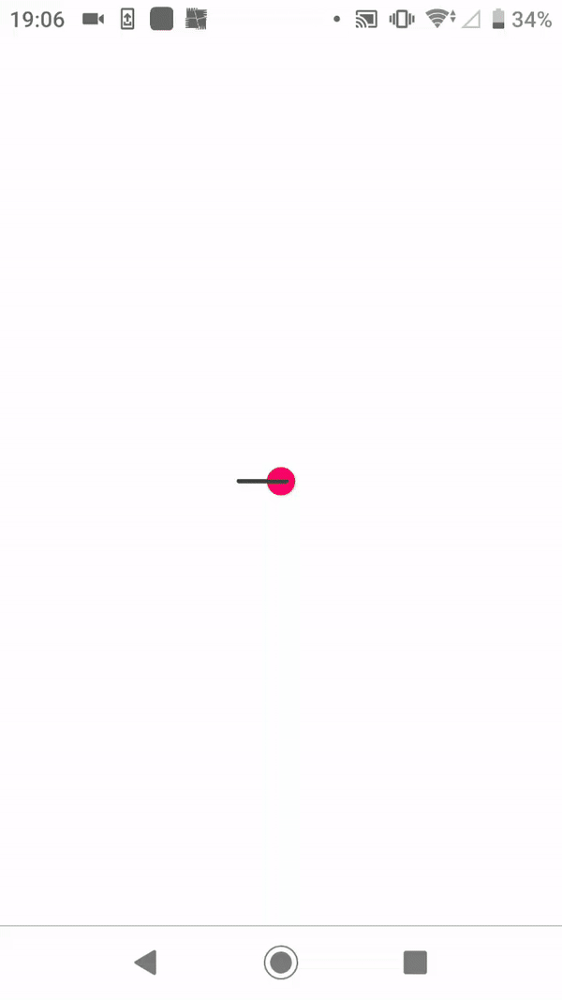

# geometry_3d

A visualisation tool for 3d geometry and modeling

To run the app: `git clone` the repo, then `yarn install` and `expo start`
You should run the app on your physical device as the app uses graphics-heavy modules.

Current default shapes: box, cone, sphere, octahedron, prism.
Custom shapes: connect input points and fill them to make 3D shapes.

Users can save a scene. Signed up users' content will be saved on Firebase Storage.

ExpoGL.View was used as the container for three-js objects.

